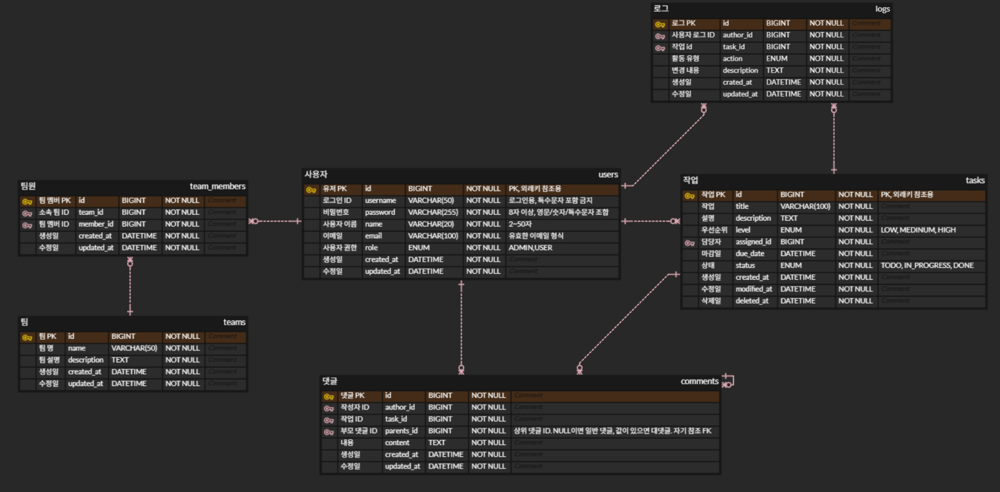

# taskflow, 아웃소싱 프로젝트

## 서비스 소개

### 서비스 개요

업무 등 협업 관계에서 일의 진행도와 통계를 보기 위한 Task Flow 웹 애플리케이션입니다.

## 주요기능

<details>
  <summary>회원가입</summary>

- 아이디와 이메일은 중복확인을 통해 유효한 아이디와 이메일만 회원가입 허용
</details>
<details>
  <summary>로그인</summary>

- 회원가입 당시의 아이디와 비밀번호로 로그인 가능
- JWT 토큰을 기반으로 관리
</details>
<details>
  <summary>Task CRUD</summary>

- TASK 작성·수정·삭제 가능
- TASK 목록 조회 및 단일 조회 가능
- TASK Status의 변경 가능
</details>
<details>
  <summary>Comment CRUD</summary>

- Task 에 댓글 작성·수정·삭제 가능
- 대댓글 작성 가능
</details>
<details>
  <summary>Team CRUD</summary>

- TEAM 만들기·삭제 가능
- TEAM MEMBER 추가·삭제 가능
</details>

## ERD


## API 명세서

<details>
  <summary>공동 응답 형식</summary>

```json
{
    "success": boolean,    // true/false
    "message": string,     // 응답 메시지
    "data": T,            // 실제 데이터 (null 가능)
    "timestamp": string    // ISO 8601 형식
}
```
</details>

### BaseURI : /api

### auth
| 기능   | METHOD | ENDPOINT (URI)    |
|------|--------|-------------------|
| 회원가입 | POST   | /auth/register    |
| 로그인  | POST   | /auth/login       |
| 로그아웃 | POST   | /auth/logout      |
| 회원탈퇴 | DELETE | /auth/withdraw    |   

### user
| 기능            | METHOD | ENDPOINT (URI)                   |
|---------------|--------|----------------------------------|
| 프로필 조회        | GET    | /users/me                        |
| 추가적으로 필요한 API | GET    | /users                           |
| 추가 가능한 사용자 목록 | GET | /users/available?teamId={teamId} |

### task
| 기능   | METHOD | ENDPOINT (URI)      |
|------|--------|---------------------|
| task 생성 | POST | /tasks              |
| task 목록 조회 | GET | /tasks?status=TODO  |
| task 상세 조회 | GET | /tasks/{taskId}     |
| task 수정 | PUT | /tasks/{taskId}     |
| task 상태 업데이트 | UPDATE | /tasks/{taskId}     |
| task 삭제 | DELETE | /tasks/{taskId}     |

### comment
| 기능   | METHOD | ENDPOINT (URI)                       |
|------|--------|--------------------------------------|
| 댓글 작성 | POST | /tasks/{taskId}/comments             |
| 대댓글 작성 | POST | /tasks/{taskId}/comments             |
| 댓글 조회 | GET | /tasks/{taskId}/comments/{commentId} |
| 댓글 수정 | PUT | /tasks/{taskId}/comments/{commentId} |
| 댓글 삭제 | DELTE | /tasks/{taskId}/comments/{commentId} |

### team
| 기능   | METHOD | ENDPOINT (URI)                   |
|------|--------|----------------------------------|
| 팀 생성 | POST | /teams                           |
| 팀 멤버 추가 | POST | /teams/{teamId}/members          |
| 팀 목록 조회 | GET | /teams                           |
| 특정 팀 조회 | GET | /teams/{teamId}                  |
| 팀 멤버 조회 | GET | /teams/{teamId}/members          |
| 팀 정보 수정 | PUT | /teams/{teamId}                  |
| 팀 삭제 | DELETE | /teams/{teamId}                  |
| 팀 멤버 삭제 | DELETE | /teams/{teamId}/members/{userId} |

### Search
| 기능   | METHOD | ENDPOINT (URI) |
|------|--------|----------------|
| 통합 검색 | GET | /search        |
| 작업 검색 | GET | /tasks/search  |

## 기술 스택
**Language**


**IDE**


**Backend**

 

**Data Base**


**Test**

 

**Collaboration Tool**

  
